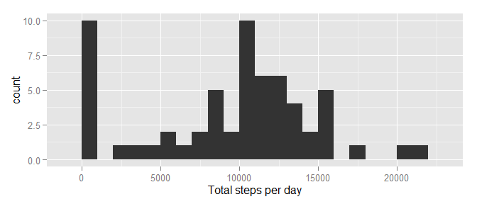
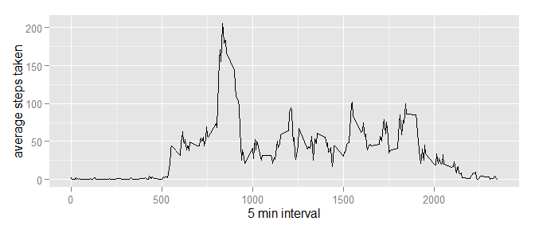
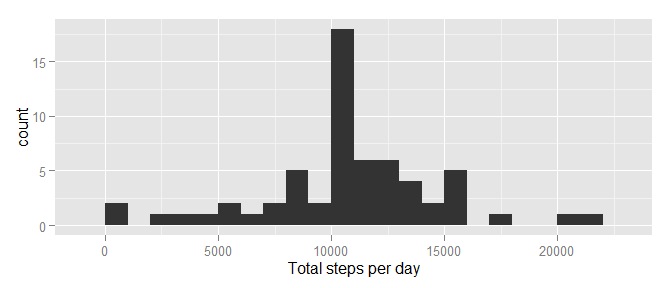
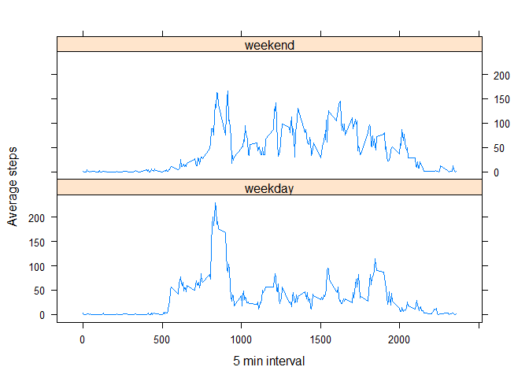

# Reproducible Research: Peer Assessment 1

  
  

  
   
   
### Loading and preprocessing the data

```r
unzip(zipfile = "activity.zip")
activity <- read.csv("activity.csv")
str(activity)
```

```
## 'data.frame':	17568 obs. of  3 variables:
##  $ steps   : int  NA NA NA NA NA NA NA NA NA NA ...
##  $ date    : Factor w/ 61 levels "2012-10-01","2012-10-02",..: 1 1 1 1 1 1 1 1 1 1 ...
##  $ interval: int  0 5 10 15 20 25 30 35 40 45 ...
```

### What is mean total number of steps taken per day?

```r
library(ggplot2)
total.steps <- tapply(activity$steps, activity$date, FUN=sum, na.rm=TRUE)
qplot(total.steps, binwidth=1000, xlab="Total steps per day")
```

 

Mean of the total number of steps taken per day

```r
mean(total.steps, na.rm=TRUE)
```

```
## [1] 9354.23
```

Median of the total number of steps taken per day

```r
median(total.steps, na.rm=TRUE)
```

```
## [1] 10395
```

### What is the average daily activity pattern?

```r
library(ggplot2)
averages <- aggregate(x=list(steps=activity$steps), by=list(interval=activity$interval), 
    FUN=mean, na.rm=TRUE)
ggplot(data=averages, aes(x=interval, y=steps)) + geom_line() + xlab("5 min interval") + ylab("average steps taken")
```

 
  
Which 5-minute interval, on average across all the days in the dataset, contains the maximum number of steps?

```r
averages[which.max(averages$steps), ]
```

```
##     interval    steps
## 104      835 206.1698
```

### Imputing missing values
The total number of missing values in the dataset 

```r
nrow(activity[is.na(activity$steps),])
```

```
## [1] 2304
```
  
Fill in all of the missing values using the rounded mean for that 5-minute interval

```r
#Create function to replace NA value for steps with the average number of steps for the same 5 min interval
new.steps <- function(steps, interval) {
    if (is.na(steps)) 
        new_steps <- round(averages[averages$interval==interval, "steps"])
    else
        new_steps <- c(steps)
        
    return(new_steps)
}
#Create new dataframe
new.activity <- activity
#Call function for each row and replace NAs
new.activity$steps <- mapply(new.steps, new.activity$steps, new.activity$interval)    
```


```r
library(ggplot2)
new.total.steps <- tapply(new.activity$steps, new.activity$date, FUN=sum, na.rm=TRUE)
qplot(new.total.steps, binwidth=1000, xlab="Total steps per day")
```

 

Mean of the total number of steps taken per day

```r
mean(new.total.steps)
```

```
## [1] 10765.64
```

Median of the total number of steps taken per day

```r
median(new.total.steps)
```

```
## [1] 10762
```
Do these values differ from the estimates from the first part of the assignment?   Yes

What is the impact of imputing missing data on the estimates of the total daily number of steps?  The mean increases significantly

### Are there differences in activity patterns between weekdays and weekends?

```r
isweekend <- weekdays(as.Date(new.activity$date)) %in% c("Saturday", "Sunday")
new.activity$weekend <- "weekday"
new.activity$weekend[isweekend == TRUE] <- "weekend"
```


```r
new.interval <- aggregate(steps ~ interval + weekend, new.activity, mean)
names(new.interval)[3] <- "meansteps"
```


```r
library(lattice)
xyplot(
        meansteps ~ interval | weekend,
        new.interval,
        type = "l",
        layout = c(1,2),
        xlab = "5 min interval",
        ylab = "Average steps"
)
```

 
  
Weekday activity is initially more, starting earlier, but weekends have more activity spread throughout the day and ending later than weekdays.
